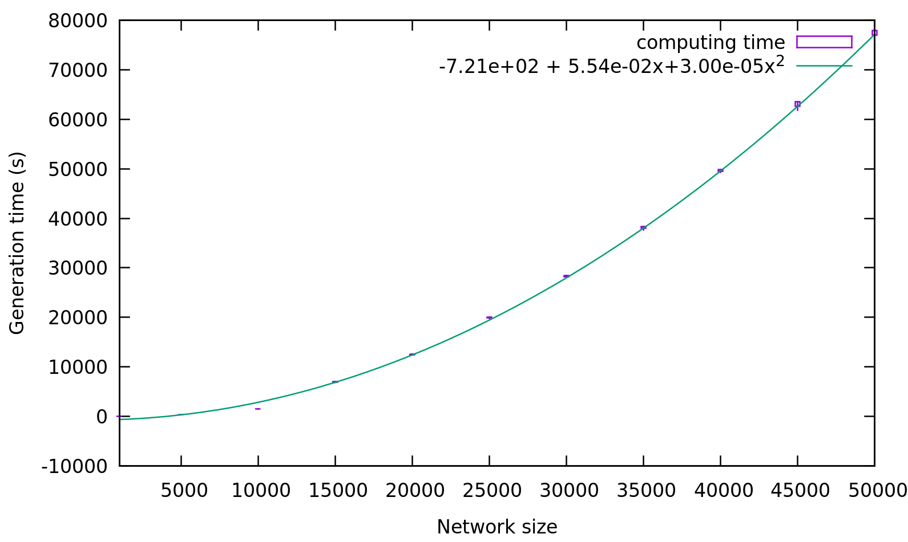

# Scripts to test the BGP topology generator

This repository contains Python scripts to test the main properties of the BGP topology generator that I am developing for the networkx library, as part of the IoF project financed by the [Fed4Fire+ open call](https://www.fed4fire.eu/event/5th-fed4fire-open-call-experiments/).

## Introduction
The Internet uses the BGP protocol to disseminate routing information among routers operated by different and competing operators. The term "Internet topology" generally refers to the topological information derived by what BGP tells: nodes are ASes and edges are relationships between them.
In some cases one wants to run experiments on topologies that are similar to the Internet topology, but not exactly that one. For instance, one may want to emulate the behaviour of BGP in smaller networks or in several different networks of approximately the same size.

In the scientific literature there is one algorithm that is used to generate random topologies with features that are similar to those that derived by the analysis of BGP traces, which was described by Elmokashfi et. al. in a paper published in 2010 in [IEEE JSAC](https://ieeexplore.ieee.org/abstract/document/5586438). Since the code is currently unavailable I decided to reimplement this generator in Python.

This repository collects the tools necessary to evaluate the performance of the generator, and to study the macroscopic features of the generated graphs and check that they correspond to the feature reported in the original paper. The paper does a qualitative analysis of the topological features, and we repeat the same kind of analysis. 

## Speed of the generator

The generator first adds the nodes in the graph, and then for each node it adds links to other nodes. Each node may be a customer, a provider or a peer of any neighbour node, and every node X has a customer tree, that is, a subgraph rooted in X that uses X to access the rest of the network. The most computationally intensive operation is required to check that when we add an edge to node X, this edge must not point to some node Y in the customer tree of X, that is, we have to ensure that X does not become a customer of some node in its own customer tree (that's a loop, and it is not allowed in the valley-free model for BGP). Same thing for a peering link.

The overall complexity of the generator is polynomial with the number of nodes.
The following figure reports the time necessary to generate a graph with a growing number of nodes, as the average and standard deviation over 10 runs, and the best fit with a polynomial of degree 2.
Code ran on an Intel Core i7-5500U CPU @ 2.40GHz, and memory usage was negligible (less than 2% of 8GB).

All in all it takes a couple of minutes to generate a network with 1.000 nodes, half an hour for 10.000 nodes and 21 hours for a network with 50.000 which makes the generator usable, considering that the number of ASs on the Internet is in the order of [65k](http://www.cidr-report.org/as2.0/).

## Statistical properites

TBD.
